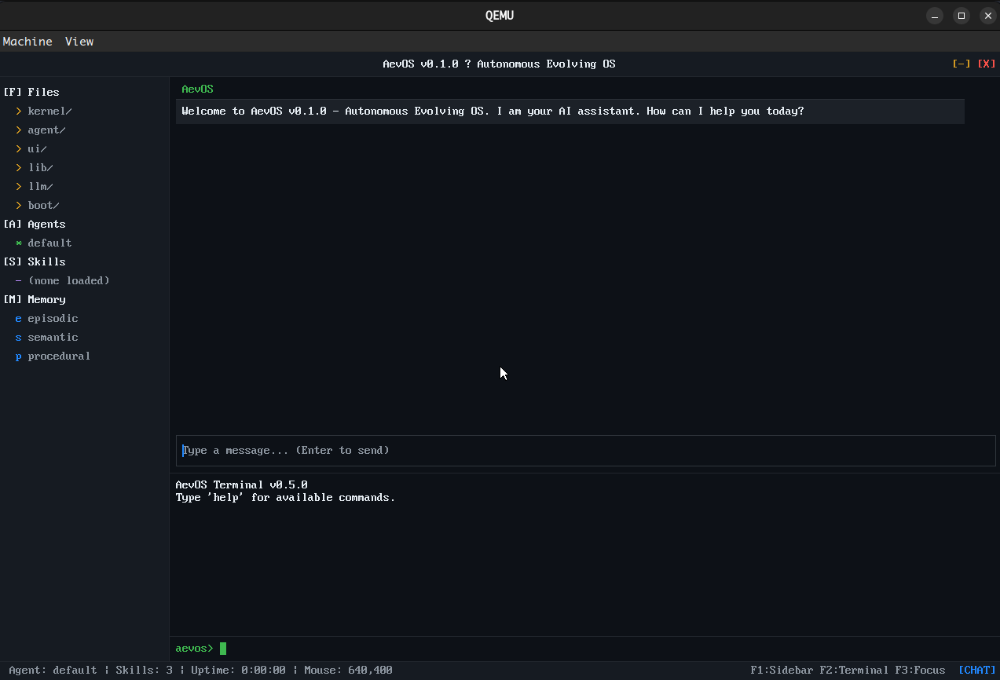

# AevOS — Autonomous Evolving OS v0.1.0

AevOS is a bare-metal operating system designed to run AI agents natively,
without Linux or any other host OS. It boots via UEFI, manages its own memory
and scheduling, embeds an LLM inference runtime (based on llama.cpp concepts),
and provides a Cursor-style shell UI — all from power-on in under 2 seconds.

## Screenshot

The framebuffer shell (dark theme, sidebar, AI chat, terminal, and status bar):



## Documentation

- [English](docs/en/README.md) — features, build, run, and boot configuration
- [简体中文](docs/zh/README.md) — 同上（中文）
- Topic pages: [architecture](docs/en/architecture.md) · [HMS](docs/en/hms.md) · [LC](docs/en/container.md) · [L3 evolution](docs/en/evolution.md) · [LLM syscall](docs/en/llm-syscall.md) (and `docs/zh/` counterparts)

## Architecture (AevOS-Evo roadmap)

Layer numbering matches `ideas/ideas2.md` and [docs/en/architecture.md](docs/en/architecture.md): **L0–L4**. **L2** is one plane with **three pillars** (LLM, LC, HMS); **L3** has **two columns** (agent runtime, self-evolution).

```
┌─────────────────────────────────────────────────────────────────┐
│  L4  AevOS Shell  (framebuffer UI / CLI / WebSocket)            │
├─────────────────────────────────────────────────────────────────┤
│  L3  Agent Layer                                                │
│  ┌──────────────────────────┬────────────────────────────────┐  │
│  │  Agent Runtime           │  Self-Evolution Plane          │  │
│  │  EventLog, mailbox,      │  Planner / Corrector /         │  │
│  │  tool states, cancel     │  Verifier / Evolver            │  │
│  └──────────────────────────┴────────────────────────────────┘  │
├─────────────────────────────────────────────────────────────────┤
│  L2  AI Infrastructure (LLM │ LC │ HMS + semantic cache tiers)   │
├─────────────────────────────────────────────────────────────────┤
│  L1  Micro-kernel (PMM, VMM, coroutines, VFS, net, virtio-net) │
├─────────────────────────────────────────────────────────────────┤
│  L0  UEFI boot (boot.json, kernel.elf, GOP)                     │
└─────────────────────────────────────────────────────────────────┘
```

**L0** — UEFI bootloader reads `\EFI\AevOS\boot.json` when present (falls back to
defaults), loads `kernel.elf`, initializes GOP, passes `boot_info_t` to the kernel.

**L1** — C17 micro-kernel: PMM/VMM/slab, cooperative coroutines, drivers (NVMe,
AHCI on x86_64, virtio-GPU, virtio-net, HID, …), VFS with `/proc` and `/dev`, and
an in-kernel IPv4 stack.

**L2** — **LLM pillar:** GGUF inference and `llm_sys_*`; remote OpenAI-compatible path
is stubbed until HTTP/TLS is complete. **LC pillar:** container compatibility (skill
sandbox, IFC, Linux syscall shim, OCI) under `src/container/`. **HMS pillar:** agent
storage—ring-buffer history (B+/WAL planned), HNSW memory, skills; `hms_cache` is a
multi-tier semantic cache (see docs: tiers C1–C3, not OS “L1”).

**L3** — **Agent runtime column:** append-only `EventLog`, MPMC `mailbox`, Neoclaw-style
tool states, scheduler cancel broadcast. **Self-evolution column:** scaffold under
`src/evolution/` (planner, corrector, verifier, evolver).

**L4** — Framebuffer shell with streaming chat helpers, **Aero-style** glass theming,
and internal Wayland-like protocol (`aevos_wl_*`) for compositor-style layout.

## Directory Layout

```
src/
├── boot/               UEFI bootloader
├── kernel/             Micro-kernel (arch, mm, sched, ipc, drivers, fs, net)
├── agent/              Agent core, eventlog, mailbox, hms_cache, history_wal, …
├── llm/                LLM runtime, llm_syscall, llm_ipc, llm_api_client (remote stub)
├── db/                 aevos_db (in-memory; optional SQLite via third_party)
├── container/          LC layer (sandbox, ifc, oci) — Linux ABI data lives in `linux/`
├── linux/              Linux ABI compat (syscall names, dispatch domains; FreeBSD-style split)
├── evolution/          L3 self-evolution scaffold (planner, corrector, verifier, evolver)
├── ui/                 Shell, terminal, chat, ws_bridge stub, wl protocol
├── posix/, lib/, tools/, include/aevos/
third_party/sqlite3/    Drop sqlite amalgamation here when enabling on-disk DB
```

## Prerequisites

- **GCC cross-compiler**: e.g. `x86_64-elf-gcc` (see `Makefile` fallbacks)
- **GNU-EFI**: UEFI bootloader
- **mtools**: FAT32 images
- **QEMU + firmware** (OVMF / AAVMF / EDK2 per architecture)

### Install on Ubuntu/Debian

```bash
sudo apt install gcc gnu-efi mtools qemu-system-x86 ovmf
```

## Building

```bash
make
make ARCH=aarch64
make ARCH=riscv64
make ARCH=loongarch64
make AEVOS_EMBED_LLM=0   # optional: no in-kernel GGUF; llm_ipc userspace path
make boot / kernel / image / tools
make info
```

## Running

```bash
make run
```

QEMU is started with a **virtio-net-pci** NIC on `user` networking where the
platform supports PCI (see `Makefile`).

## Boot Configuration

`boot.json` on the ESP at `\EFI\AevOS\boot.json` (see example in
[docs/zh/README.md](docs/zh/README.md)).

## Version History

| Version | Milestone |
|---------|-----------|
| v0.1.0+ | Evo roadmap: virtio-net, procfs/devfs, EventLog, llm_syscall, LC + L3 evolution scaffolds |
| v0.1.0  | Baseline headers, slab 64 KiB, klog tags |

## License

LGPL-2.1.
